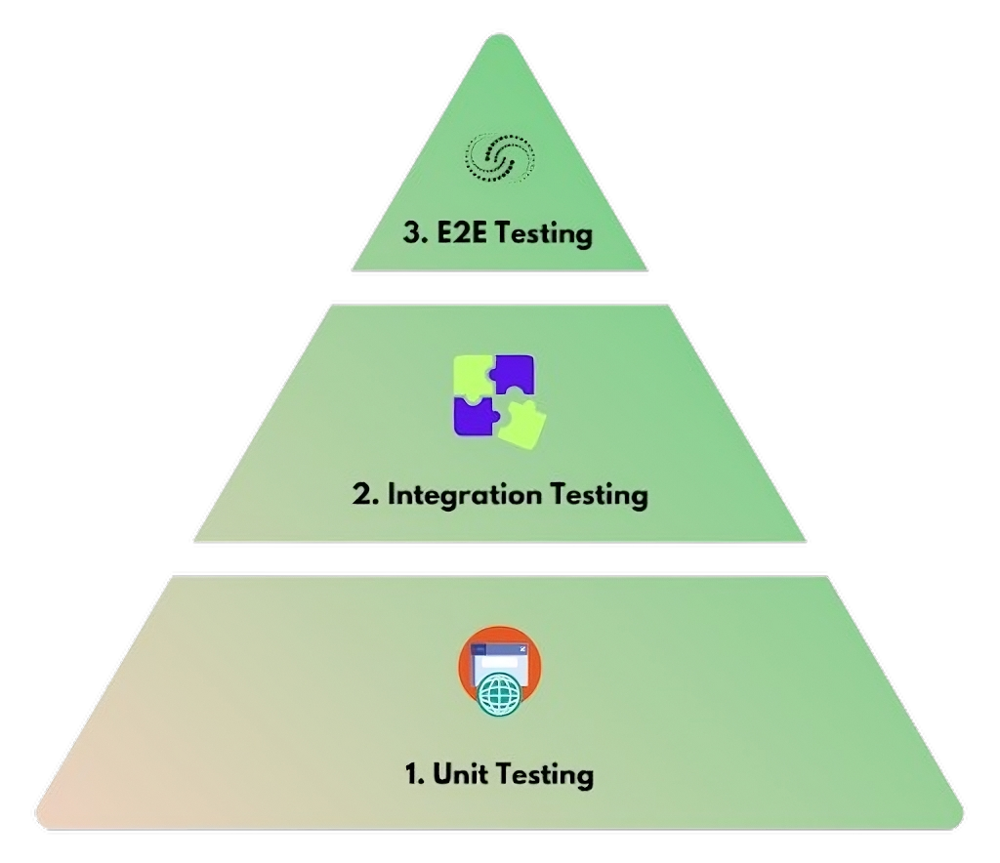

# Clase N°5: Testing
*Desarrollo de Software K3552 (Martes Noche)*

**Fecha: 16 de Septiembre de 2025**

# Resumen

En esta clase introducimos los fundamentos del **testing** en desarrollo de software: conceptos clave, tipos de pruebas y su organización.

También veremos enfoques modernos como **BDD**, **mocking** y **TDD**, que ayudan a diseñar sistemas más confiables y fáciles de mantener.

## 📑Índice

- [Introducción](#introduccion)
- [Estructura](#estructura)
- [Automatización](#automatizacion)
- [Independencia](#independencia)
- [Clasificación](#clasificacion)
	- [Unitarios](#unitarios)
	- [Integración](#integracion)
	- [Funcionales (o E2E)](#funcionales)
	- [Pirámide de testing](#piramide-testing)
- [BDD](#bdd)
- [Mocking](#mocking)
- 🔴🟢[TDD](#tdd)

<a id="introduccion"></a>
## Introducción

Cuando hablamos de **testing** nos referimos a la disciplina que permite verificar si el software cumple con lo esperado.

Aunque pueda sonar técnico, la idea es bastante cotidiana. Pensemos en la compra de un auto: antes de salir a la ruta, uno prueba que arranque, que los frenos funcionen y que las luces respondan.

En el desarrollo de software ocurre lo mismo. Antes de confiar en un programa necesitamos comprobar que responde como se espera.

En la práctica, ningún sistema está libre de errores. Sin embargo, podemos reducir la incertidumbre sometiéndolo a distintas pruebas. Estas pruebas contrastan el resultado esperado con el real, y cuando aparecen diferencias, hablamos de *bugs*.  

> **Observación**: Un conjunto de tests que nunca detecta errores seguramente no esté cubriendo los escenarios correctos.

Para organizarlos, conviene pensar en los distintos caminos de ejecución que un sistema puede recorrer:

- **Camino feliz:** todo sale según lo previsto.

   > **Ejemplo:** un usuario ingresa sus credenciales correctas y accede al sistema.

- **Camino no feliz:** se presentan casos de error previsibles.

   > **Ejemplo:** un usuario escribe mal su contraseña y se le niega el acceso.

- **Caminos poco esperables:** situaciones extremas o poco comunes.

   > **Ejemplo:** intentar subir una foto de 10 GB a una red social.

La base para definir qué caminos conviene probar son los **requerimientos**. Cada requisito debería derivar en al menos un caso de prueba.

Para darles más orden distinguimos dos niveles:

- **Clases de test:** agrupan conceptualmente las pruebas sobre una misma funcionalidad. Ejemplo: todos los tests de login.

- **Casos de test:** son instancias concretas con entradas, acciones y expectativas. Ejemplo: “login con contraseña correcta concede acceso”.

<a id="estructura"></a>
## Estructura
Un test bien diseñado sigue una narrativa clara que puede resumirse en tres pasos:

1. **Precondiciones**: definimos el contexto inicial, configurando datos, objetos o estados necesarios.  
2. **Operación**: realizamos la acción que queremos validar.  
3. **Postcondiciones**: verificamos el resultado esperado mediante aserciones.  

> **Observación**: si la operación no modifica el estado (por ejemplo, una función pura), basta con validar el valor retornado.

Más adelante veremos un esquema que servirá de guía en la mayoría de los enfoques modernos de testing.

<a id="automatizacion"></a>
## Automatización

Automatizar tests no es un fin en sí mismo: conviene hacerlo solo cuando aporta verdadero valor. Una forma de evaluarlo es hacerse estas tres preguntas:  

1. **¿Es posible automatizar este test?**  
   
	Sí, siempre que las entradas y salidas estén bien definidas.  

   > **Ejemplo:** un test unitario que valida la lógica de una clase.  

2. **¿Qué beneficio aporta automatizarlo?**  
   
	La automatización brilla cuando necesitamos feedback rápido y confiable.  

   > **Ejemplo:** al construir un service que utiliza clases de dominio, podemos automatizar los tests para asegurarnos de que la lógica central siga funcionando sin romperse.

3. **¿Será mantenible en el tiempo?**  
   
	Un test que se rompe con cada cambio deja de ser una ayuda y se vuelve una carga.  

   > **Ejemplo:** un test de UI que falla cada vez que cambia el nombre de un botón termina dando más ruido que certezas.  

En resumen, automatizar vale la pena en lo que es estable, rápido de ejecutar y útil a largo plazo. El resto conviene revisarlo manualmente.

<a id="independencia"></a>
## Independencia

Un principio básico del testing es la **independencia**: cada test debe poder ejecutarse por sí solo y ser determinístico sin importar el contexto o el orden en que se ejecute.  

En la práctica, esto significa que:  

- No se deben **encadenar pruebas**, es decir, un test no debe preparar datos que otro necesite.  

   > **Ejemplo:** un test que crea un usuario no debería dejarlo disponible para que otro test lo use.  

- Se debe **restaurar el estado**: al terminar un test, todo debería volver a condiciones limpias.  

   > **Ejemplo:** si en un test agregamos elementos a una lista y no la vaciamos, otro test podría empezar con datos “sucios” y fallar por un motivo ajeno a lo que realmente prueba.  

- Los tests deben poder **ejecutarse en paralelo** sin chocar entre sí.  

   > **Ejemplo:** dos tests que escriben en el mismo archivo al mismo tiempo pueden interferirse y dar errores falsos.  

Cuando se cumple este principio, los tests ofrecen resultados confiables y fáciles de interpretar.

<a id="clasificacion"></a>
## Clasificación

<a id="unitarios"></a>
### Unitarios

Los **tests unitarios** se concentran en la **unidad mínima de lógica**, como una función o un método.  

Su propósito es verificar que cada pieza del sistema hace exactamente lo que debería en aislamiento, sin depender de otros módulos.  

Tienen como ventaja que son rápidos de ejecutar, fáciles de escribir y localizan el error justo en el lugar donde ocurre.

> **Cuando una función deja de comportarse como se espera, un test unitario debería detectarlo de inmediato.**  

Por ejemplo, con [Jest](https://jestjs.io/) podemos validar una función simple:

```js
// suma.test.js
test('suma dos números', () => {
  expect(sumar(2,3)).toBe(5);
});
```

<a id="integracion"></a>
### Integración

Los **tests de integración** verifican que varios módulos funcionen bien en conjunto.

Su propósito es detectar errores que no aparecen en unitarios, como datos mal formateados, dependencias incorrectas o respuestas que no cumplen el contrato esperado.  

Aunque son más lentos y costosos que los unitarios, aportan confianza en que las piezas, además de funcionar aisladas, también lo hacen cuando se combinan.  

Por ejemplo, con [Supertest](https://www.npmjs.com/package/supertest) podemos validar que un endpoint responda como esperamos:  

```js
import request from 'supertest';
import app from '../app';

test('GET /usuarios devuelve 200', async () => {
  const res = await request(app).get('/usuarios');
  expect(res.status).toBe(200);
});
```

<a id="funcionales"></a>
### Funcionales (o E2E)

Los **tests funcionales** o **E2E** (*end to end*) validan el sistema completo **tal como lo usaría una persona real**.  

Simulan un flujo de principio a fin: abrir la aplicación, ingresar datos, interactuar con la interfaz y comprobar el resultado final.  

Su propósito es garantizar que todas las partes del sistema —frontend, backend, base de datos, servicios externos— trabajen coordinadas para ofrecer la experiencia esperada.  

Son más lentos y costosos de mantener que unitarios e integración, pero son los que más se acercan a la realidad del usuario. Por eso, aunque deben ser pocos, aportan un nivel de confianza que los demás no pueden dar.  

Ejemplo con [Cypress](https://www.cypress.io/):  

```js
it('login exitoso (camino feliz)', () => {
  cy.visit('/login');
  cy.get('#usuario').type('ana');
  cy.get('#password').type('secreto');
  cy.contains('Ingresar').click();
  cy.url().should('include', '/home');
});
```

<a id="piramide-testing"></a>
### Pirámide de testing

Cuando hablamos de distintos tipos de pruebas, nos preguntamos: **¿cuántas hacer de cada una?**.

La pirámide de testing es una metáfora visual que responde justamente a eso, mostrando la proporción recomendada entre unitarios, integración y E2E.  

<p align="center">
  
</p>

La **base más ancha** corresponde a los tests unitarios: rápidos y abundantes, son los que sostienen la suite.  

En el **nivel intermedio** están los de integración: menos numerosos, pero esenciales para verificar cómo se combinan los módulos.  

Por último, en la **punta** se ubican los E2E: pocos, lentos y costosos, pero valiosos para validar los flujos críticos de principio a fin.  

En conclusión, la pirámide muestra que una buena suite no se apoya en un solo tipo de test, sino en combinar varios niveles con equilibrio.

<a id="bdd"></a>
## BDD

El **Behavior-Driven Development (BDD)** es una forma de pensar el desarrollo centrada en el comportamiento esperado del sistema.  

La idea principal es que los tests no sean solo para desarrolladores, sino también un lenguaje compartido con el negocio: escenarios que cuentan qué debería pasar en situaciones reales.  

Para expresar esos escenarios, se utiliza este esquema:

```gherkin
Scenario: Login exitoso
  Given un usuario válido
  When ingresa su contraseña correcta
  Then accede al sistema
```

> **Dato**: Esta forma de escritura se llama **Gherkin**, y se apoya en el esquema **Given / When / Then**.

A diferencia de los tests clásicos, que son más técnicos y atómicos, BDD utiliza escenarios completos que se leen casi como especificaciones. De esta forma, los tests cumplen dos funciones: validar el sistema y, al mismo tiempo, documentar de manera clara qué comportamiento se espera.

<a id="mocking"></a>
## Mocking

Muchas veces no podemos testear con los componentes reales: quizás porque todavía no existen, porque dependen de un servicio externo, o simplemente porque son lentos y costosos de usar en pruebas.  

En esos casos aparece el **mocking**, que consiste en crear objetos “dobles” que imitan la interfaz de los reales pero devuelven respuestas controladas. La idea no es reemplazar su lógica, sino simularla para poder avanzar.  

Imaginemos un servicio de clima que aún no está implementado. Queremos probar una función `vestir()` que decide la ropa según la temperatura. En vez de esperar al servicio real, armamos un mock que devuelva el valor que nos interesa: 

```js
const climaMock = { obtener: () => ({ temp: 25 }) };

test('elige remera si hace calor', () => {
  const resultado = vestir(climaMock);
  expect(resultado).toBe('remera');
});
```

Con este objeto *bobo* (`climaMock`) ya podemos validar la lógica de `vestir()` sin depender de nada externo. Además, tenemos control total sobre qué devuelve el mock: podemos simular tanto un resultado válido como un error, haciendo que los tests sean rápidos, predecibles y fáciles de repetir.

Finalmente, mencionemos que el mocking puede hacerse a mano, como en el ejemplo, o usando librerías como **Jest**. Según el lenguaje, esto puede ser trivial (como en JavaScript, donde los objetos son dinámicos) o más complejo (como en Java, donde usamos Mockito).

<a id="tdd"></a>
## 🔴🟢 TDD

El **Test-Driven Development (TDD)** propone escribir primero el test y después el código. Se lo suele resumir con la idea de un **semáforo**:

1. **Rojo**: el test falla porque la funcionalidad aún no existe.  
2. **Verde**: escribimos lo mínimo necesario para que el test pase.  
3. **Refactor**: mejoramos el diseño manteniendo los tests en *verde*.  

Este ciclo simple y repetitivo asegura que cada nueva funcionalidad nazca acompañada de una prueba, y que siempre tengamos feedback inmediato sobre si el sistema sigue funcionando.


